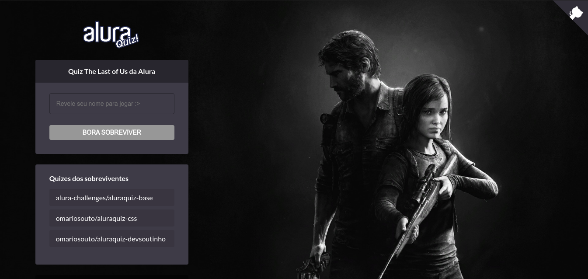

<h1 align="center">
  
</h1>

<p align="center">
   <a href="https://github.com/awlana04">
    
  </a>
</p>

<p align="center">
  <a href="#about">About</a>&nbsp;&nbsp;&nbsp;|&nbsp;&nbsp;&nbsp;
  <a href="#how-to-initialize-the-project">How to initialize the project</a>&nbsp;&nbsp;&nbsp;|&nbsp;&nbsp;&nbsp;
  <a href="#technologies-used">Technologies used</a>&nbsp;&nbsp;&nbsp;&nbsp;&nbsp;&nbsp;
</p>

<h3>
  
</h3>


## About

The **AluraQuiz** it's a project developed during the week **#ImersãoReact** promoved by Alura, where it aimed to create a quiz with the theme you such like, making use of the atual technologies like **ReactJS**, **Next.JS** and **Styled-components**.

The theme that I chose to make my quiz were the game developed by Naughty Dog, **The Last of Us**, which is one of my favorite games.

Check out the base layout made by Alura [here](https://www.figma.com/file/h7xA3Ilt0mzjWUKcWSfnsp/AluraQuiz-(Copy)?node-id=0%3A1) and access my deploy made in **Vercel** [right here](https://alura-quiz.awlana04.vercel.app/).

## How to initialize the project

To clone and run the application it's necessary you have the [git](https://git-scm.com/), [node.js](https://nodejs.org/en/) or [yarn](https://yarnpkg.com/).

```bash
  # Clone the repository
  $ git clone https://github.com/awlana04/AluraQuiz.git
  # Enter in the necessary folder
  $ cd AluraQuiz
  # Install the necessary dependecies
  $ yarn
  # Run the whole application
  $ yarn dev
```

**If you use NPM it's just alter YARN for NPM**

## Technologies used

The project were developed with the technologies:

- [ReactJS](https://pt-br.reactjs.org/)
- [Javacript](https://developer.mozilla.org/pt-BR/docs/Web/JavaScript)
- [Next.js](https://nextjs.org/)
- [prop-types](https://www.npmjs.com/package/prop-types)
- [Framer Motion](https://www.framer.com/motion/)
- [React-Lottie](https://www.npmjs.com/package/@crello/react-lottie)
- [ESLint](https://eslint.org/)

<p align='center'>
  Made with 💙 by <a href='https://github.com/awlana04'> Awlana Costa </a>
</p>